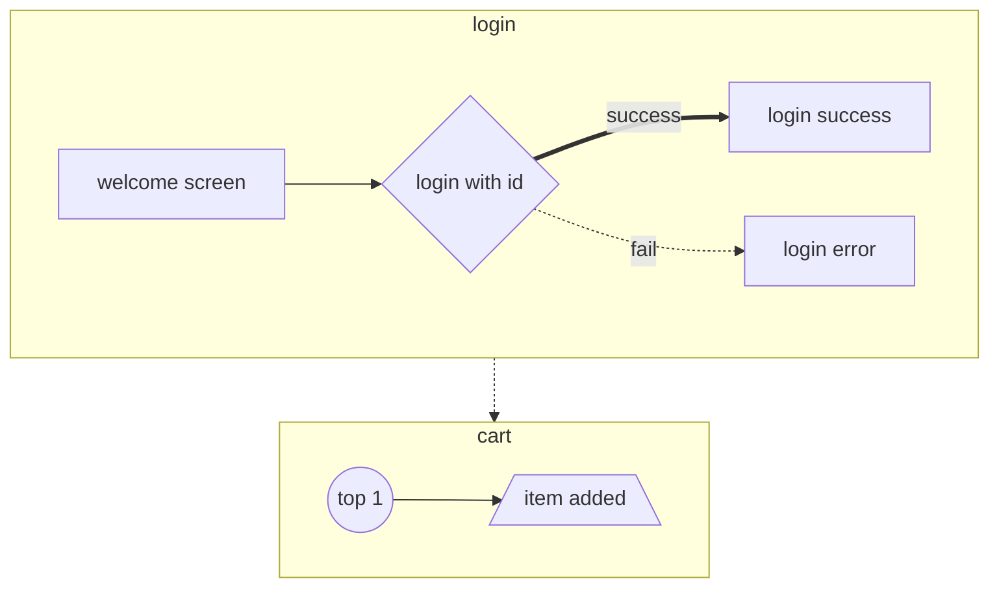

# full flow example:

```mermaid
flowchart TB
%% title full flow example
login -.-> cart
subgraph login
  welcome["welcome screen"]
  login-process{"login with id"}
  error["login error"]
  success["login success"]
  welcome --> login-process
  login-process == success ==> success
  login-process -. fail .-> error
end
subgraph cart
  top1(("top 1"))
  added[/"item added"\]
  top1 --> added
end
```
