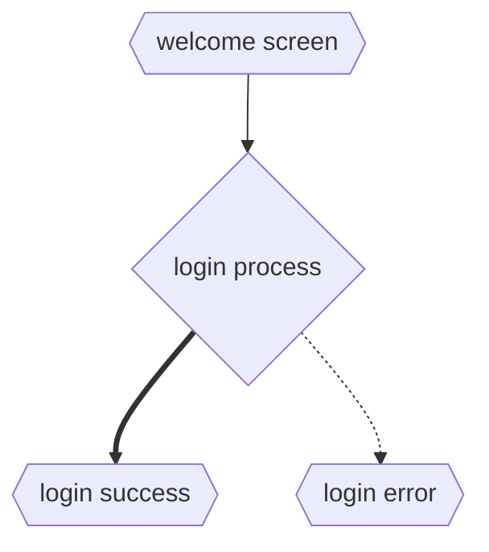

# Test Mermaid Diagram

```mermaid
graph TB
%% title Login Flow
welcome{{"welcome screen"}}
login-process{"login process"}
error{{"login error"}}
success{{"login success"}}
welcome --> login-process
login-process ==> success
login-process -.-> error
```
